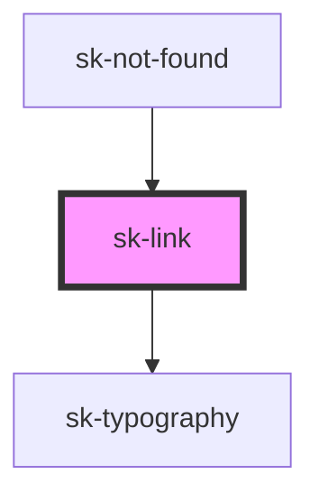

# sk-link

<!-- Auto Generated Below -->

## Properties

| Property       | Attribute       | Description | Type      | Default     |
| -------------- | --------------- | ----------- | --------- | ----------- |
| `color`        | `color`         |             | `string`  | `'inherit'` |
| `href`         | `href`          |             | `string`  | `undefined` |
| `icon`         | `icon`          |             | `string`  | `undefined` |
| `iconPosition` | `icon-position` |             | `string`  | `'left'`    |
| `preventClick` | `prevent-click` |             | `boolean` | `false`     |
| `rel`          | `rel`           |             | `string`  | `undefined` |
| `target`       | `target`        |             | `string`  | `undefined` |

## Events

| Event     | Description | Type                      |
| --------- | ----------- | ------------------------- |
| `clicked` |             | `CustomEvent<MouseEvent>` |

## Dependencies

### Used by

 - [sk-not-found](../not-found)

### Depends on

- [sk-typography](../typography)

### Graph

----------------------------------------------

*Built with [StencilJS](https://stenciljs.com/)*
