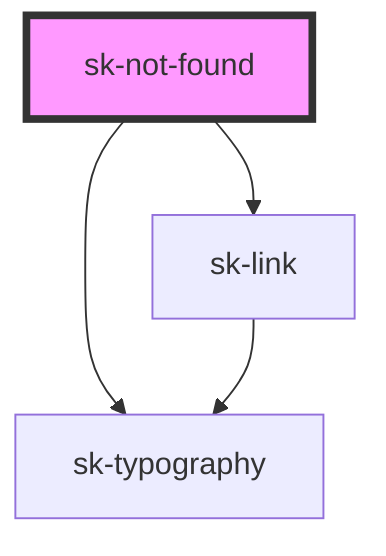

# sk-not-found

<!-- Auto Generated Below -->

## Properties

| Property           | Attribute            | Description | Type      | Default     |
| ------------------ | -------------------- | ----------- | --------- | ----------- |
| `heading`          | `heading`            |             | `string`  | `undefined` |
| `linkHref`         | `link-href`          |             | `string`  | `undefined` |
| `linkIcon`         | `link-icon`          |             | `string`  | `undefined` |
| `linkPreventClick` | `link-prevent-click` |             | `boolean` | `false`     |
| `linkText`         | `link-text`          |             | `string`  | `undefined` |
| `subheading`       | `subheading`         |             | `string`  | `undefined` |

## Dependencies

### Depends on

- [sk-typography](../typography)
- [sk-link](../link)

### Graph

----------------------------------------------

*Built with [StencilJS](https://stenciljs.com/)*
