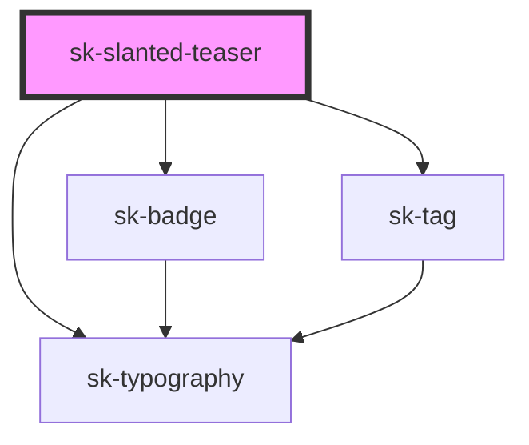

# sk-slanted-teaser

<!-- Auto Generated Below -->

## Properties

| Property   | Attribute   | Description | Type       | Default     |
| ---------- | ----------- | ----------- | ---------- | ----------- |
| `badge`    | `badge`     |             | `string`   | `undefined` |
| `heading`  | `heading`   |             | `string`   | `undefined` |
| `href`     | `href`      |             | `string`   | `undefined` |
| `linkText` | `link-text` |             | `string`   | `undefined` |
| `rel`      | `rel`       |             | `string`   | `undefined` |
| `tags`     | --          |             | `string[]` | `undefined` |
| `target`   | `target`    |             | `string`   | `undefined` |

## Dependencies

### Depends on

- [sk-typography](../typography)
- [sk-badge](../badge)
- [sk-tag](../tag)

### Graph

----------------------------------------------

*Built with [StencilJS](https://stenciljs.com/)*
