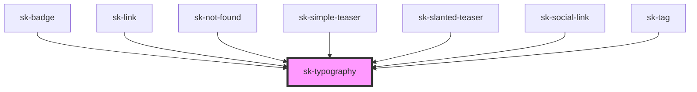

# sk-typography

<!-- Auto Generated Below -->

## Properties

| Property     | Attribute     | Description | Type     | Default           |
| ------------ | ------------- | ----------- | -------- | ----------------- |
| `as`         | `as`          |             | `string` | `'span'`          |
| `color`      | `color`       |             | `string` | `'inherit'`       |
| `lineHeight` | `line-height` |             | `string` | `'1.5'`           |
| `size`       | `size`        |             | `string` | `'16-responsive'` |

## Dependencies

### Used by

 - [sk-badge](../badge)
 - [sk-link](../link)
 - [sk-not-found](../not-found)
 - [sk-simple-teaser](../simple-teaser)
 - [sk-slanted-teaser](../slanted-teaser)
 - [sk-social-link](../social-link)
 - [sk-tag](../tag)

### Graph

----------------------------------------------

*Built with [StencilJS](https://stenciljs.com/)*
