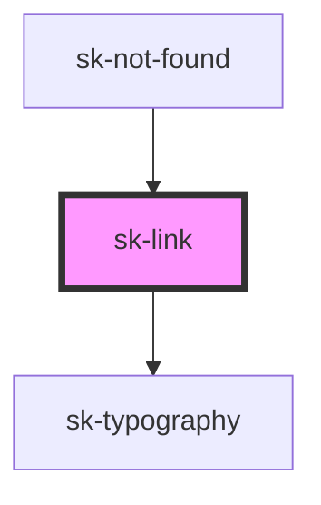

# sk-link

<!-- Auto Generated Below -->

## Properties

| Property       | Attribute       | Description | Type     | Default     |
| -------------- | --------------- | ----------- | -------- | ----------- |
| `href`         | `href`          |             | `string` | `undefined` |
| `icon`         | `icon`          |             | `string` | `undefined` |
| `iconPosition` | `icon-position` |             | `string` | `undefined` |
| `noopener`     | `noopener`      |             | `string` | `undefined` |
| `target`       | `target`        |             | `string` | `undefined` |
| `text`         | `text`          |             | `string` | `undefined` |

## Dependencies

### Used by

 - [sk-not-found](../not-found)

### Depends on

- [sk-typography](../typography)

### Graph

----------------------------------------------

*Built with [StencilJS](https://stenciljs.com/)*
