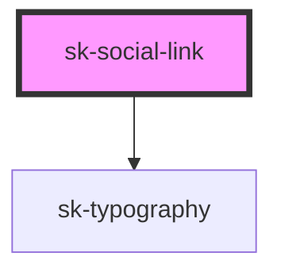

# sk-social-link

<!-- Auto Generated Below -->

## Properties

| Property            | Attribute             | Description | Type      | Default     |
| ------------------- | --------------------- | ----------- | --------- | ----------- |
| `icon`              | `icon`                |             | `string`  | `undefined` |
| `iconAddBackground` | `icon-add-background` |             | `boolean` | `undefined` |
| `iconViewbox`       | `icon-viewbox`        |             | `string`  | `undefined` |
| `text`              | `text`                |             | `string`  | `undefined` |
| `url`               | `url`                 |             | `string`  | `undefined` |

## Dependencies

### Depends on

- [sk-typography](../typography)

### Graph

----------------------------------------------

*Built with [StencilJS](https://stenciljs.com/)*
