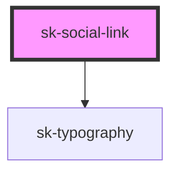

# sk-social-link

<!-- Auto Generated Below -->

## Properties

| Property         | Attribute          | Description | Type      | Default     |
| ---------------- | ------------------ | ----------- | --------- | ----------- |
| `compact`        | `compact`          |             | `boolean` | `false`     |
| `compactOnSmall` | `compact-on-small` |             | `boolean` | `false`     |
| `icon`           | `icon`             |             | `string`  | `undefined` |
| `text`           | `text`             |             | `string`  | `undefined` |
| `url`            | `url`              |             | `string`  | `undefined` |

## Dependencies

### Depends on

- [sk-typography](../typography)

### Graph

----------------------------------------------

*Built with [StencilJS](https://stenciljs.com/)*
