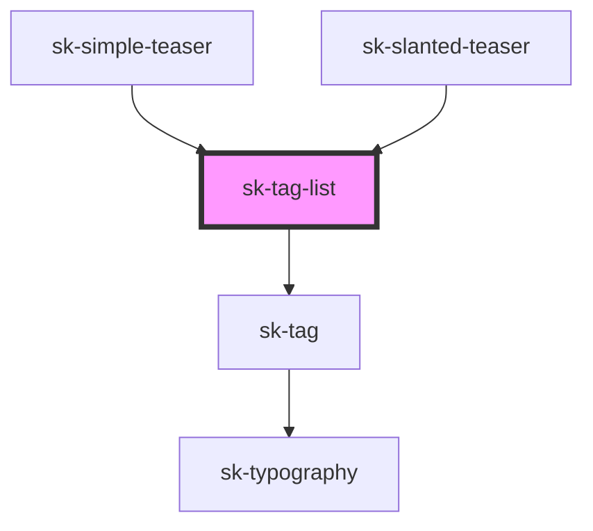

# sk-tag-list

<!-- Auto Generated Below -->

## Properties

| Property | Attribute | Description | Type       | Default     |
| -------- | --------- | ----------- | ---------- | ----------- |
| `items`  | --        |             | `string[]` | `undefined` |

## Dependencies

### Used by

 - [sk-simple-teaser](../simple-teaser)
 - [sk-slanted-teaser](../slanted-teaser)

### Depends on

- [sk-tag](../tag)

### Graph

----------------------------------------------

*Built with [StencilJS](https://stenciljs.com/)*
