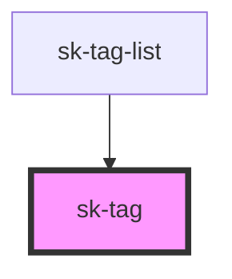

# sk-tag

<!-- Auto Generated Below -->

## Properties

| Property   | Attribute  | Description | Type      | Default     |
| ---------- | ---------- | ----------- | --------- | ----------- |
| `inverted` | `inverted` |             | `boolean` | `undefined` |
| `text`     | `text`     |             | `string`  | `undefined` |

## Dependencies

### Used by

 - [sk-tag-list](../tag-list)

### Graph

----------------------------------------------

*Built with [StencilJS](https://stenciljs.com/)*
