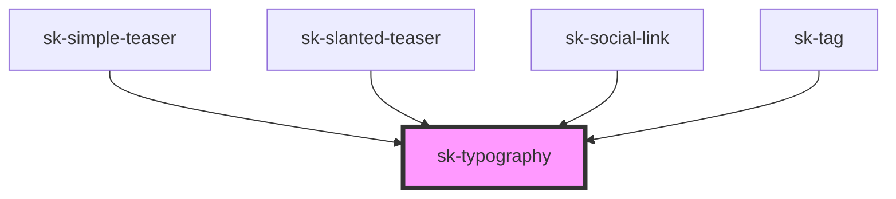

# sk-typography

<!-- Auto Generated Below -->

## Properties

| Property | Attribute | Description | Type     | Default     |
| -------- | --------- | ----------- | -------- | ----------- |
| `as`     | `as`      |             | `string` | `undefined` |
| `size`   | `size`    |             | `string` | `undefined` |

## Dependencies

### Used by

 - [sk-simple-teaser](../simple-teaser)
 - [sk-slanted-teaser](../slanted-teaser)
 - [sk-social-link](../social-link)
 - [sk-tag](../tag)

### Graph

----------------------------------------------

*Built with [StencilJS](https://stenciljs.com/)*
